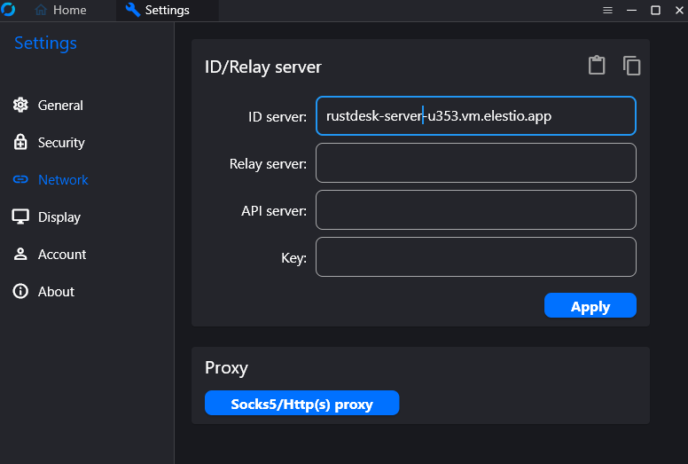
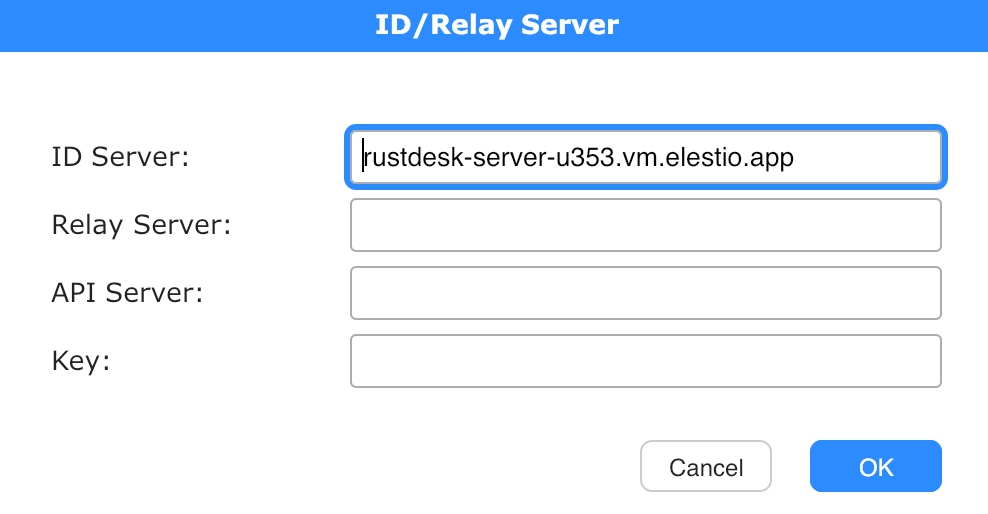
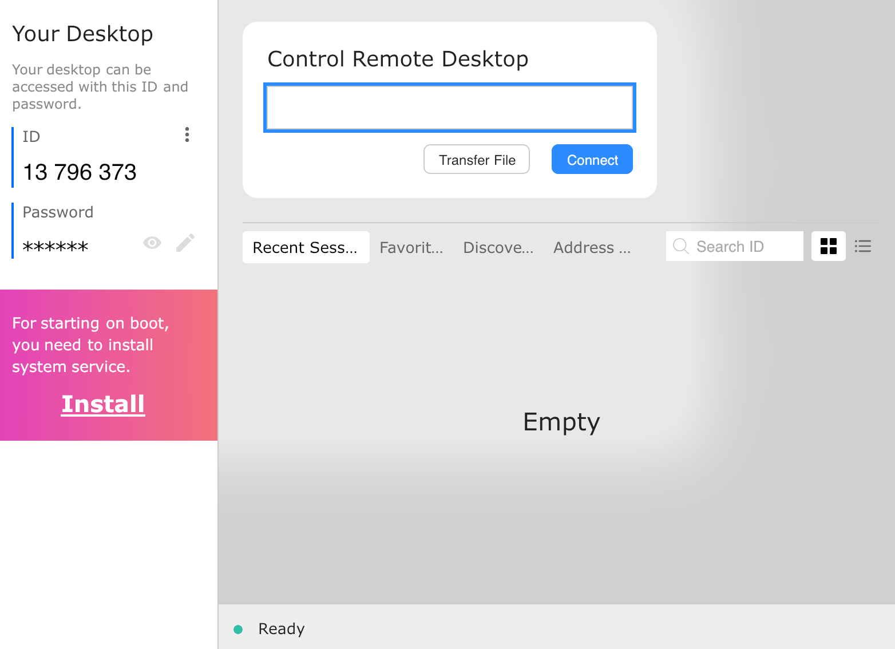

# Rustdesk Server CI/CD pipeline

Deploy Rustdesk Server with CI/CD on Elestio

 
 

# Once deployed ...

Download Rustdesk client in this link: <a target="_blank" href="https://rustdesk.com/">Rustdesk client</a>

Then, once installed, click on the Menu button [ ⋮ ] on the right side of ID as shown below, and choose “ID/Relay Server”.

In the ID SERVER field, fill with your CI/CD Domaine : [CI_CD_DOMAIN]

Click on the Menu button [ ⋮ ] on the right side of ID as shown below, and choose Enable Service.
On the bottom of the Main Screen, you will see Ready.

