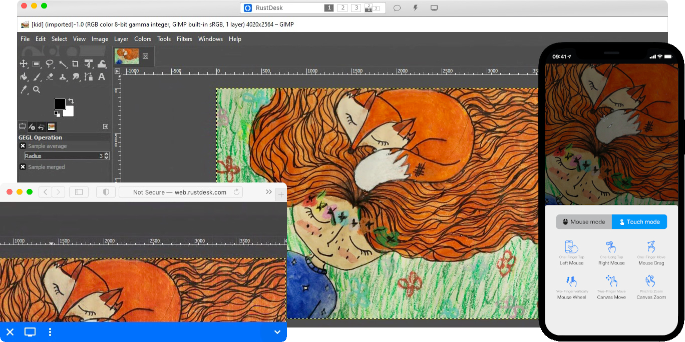

# Rustdesk Server CI/CD pipeline

Deploy Rustdesk Server with CI/CD on Elestio

 
 

# Once deployed ...

You can can open Rustdesk Server UI here:

    URL: https://[CI_CD_DOMAIN]
    Login: [ADMIN_EMAIL]
    password: [ADMIN_PASSWORD]
